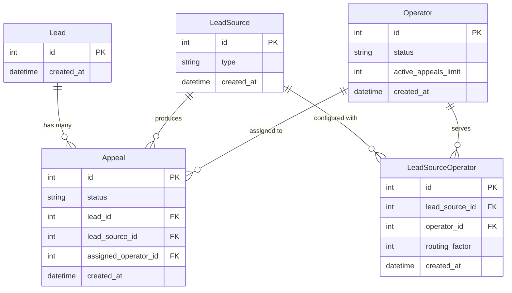

## Запуск

1. Установить `docker` и `make`.
2. Скопировать все `.env.example` → `.env` и заполнить.
3. Запустить:
   ```bash
   make up
    ```
4. По умолчанию (.env.example), REST API будет доступен по адресу http://127.0.0.1:8080

## Немного про структуру кода

Данная структура и всякие инфраструктурные штуки (вроде запуска миграций) я
взял из своего открытого репо

https://github.com/TheArcherST/hack

Там лежит бэкенд с недавнего хакатона.  Эта структура -- результат множества
таких вот переносов структуры из проекта в проект с сопутствующими
доработками / адаптациями.

Что вам может быть интересно сразу увидеть:
1. **Модели**: [python/src/hack/core/models](https://github.com/TheArcherST/test-task/tree/master/python/src/hack/core/models)  
2. **Роутеры**: [python/src/hack/rest_server/routers](https://github.com/TheArcherST/test-task/tree/master/python/src/hack/rest_server/routers)  
3. **Тесты**: [python/src/hack/integration_tests](https://github.com/TheArcherST/test-task/tree/master/python/src/hack/integration_tests)

Примечание: с утра перечитал ТЗ и понял, что забыл про эндпоинты для просмотра
данных по лидам и их обращениям. По мере их добавления понял, что просто взять
инфру написанную под PostgreSQL и подставить драйвер для SQLite... было не 
лучшей идеей.  Решил проблему с тем, что FK и транзакции не работали.

## Интеграционные тесты

1. Запустить:
    ```bash
    make test 
    ```

Примечание: тесты сгенерировал нейросетью по референсу.  Указывал что именно 
надо тестить + просмотрел результаты глазами -- основные моменты действительно
неплохо покрыты.

## Модель данных

| Сущность               | Описание                                                                                                         | Связи                                                                                                                          |
|------------------------|------------------------------------------------------------------------------------------------------------------|--------------------------------------------------------------------------------------------------------------------------------|
| **Lead**               | Лид.  Предполагается что внешняя система работает с проблемами идентификации, мы работаем с готовым id           | Один **Lead** может иметь много **Appeal** (обращений).                                                                        |
| **LeadSource**         | Откуда лид пришёл (есть поле `type`, сейчас только `BOT`)                                                        | Один **LeadSource** может производить много **Appeal** и быть связан с несколькими **Operator** через **LeadSourceOperator**.  |
| **Operator**           | Оператор                                                                                                         | Один **Operator** может обрабатывать много **Appeal** и быть связан с несколькими **LeadSource** через **LeadSourceOperator**. |
| **LeadSourceOperator** | Оператор в контексте источника лидов (содержит настройки, относящиеся к обслуживанию оператором этого источника) | Связывает **LeadSource** и **Operator** в отношении «многие ко многим».                                                        |
| **Appeal**             | Обращение                                                                                                        | Каждое **Appeal** связано с одним **Lead**, одним **LeadSource** и одним **Operator**.                                         |


## Алгоритм распределения

1. Прослеживаем лидов по простому целочисленному id.  Я не стал делать логику 
   решения проблем идентификации, которые мог бы тут придумать.  Если бы было
   больше времени и/или желания, можно было бы сделать отдельный сервис, 
   который бы помогал переводить набор идентификационных признаков в ссылку на 
   запись в бд.
2. Свободные операторы загружаются в сервис, тот по первой предложенной схеме
   (случайный выбор с вероятностью) выбирает среди них нужного. Процесс выбора
   лочит операторов, затем идёт присвоение выбранного оператора, затем сессия
   коммитится.
3. Распределение на уровне кода сервиса идёт только между свободными 
   операторами.  Свободен ли оператор определяется внутри SQL запроса.
4. Если подходящих операторов нет, оператор не назначается.  Просто в заявке 
   будет поле с NULL.

Вообще тут бы что-то вроде очереди pending обращений, для которых бэк пытается
найти оператора.  Но это тестовое, и требований таких нет, так-что пока вот 
так.


